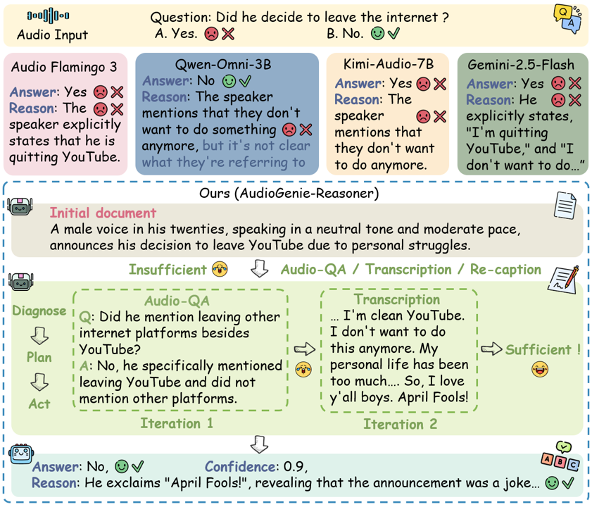
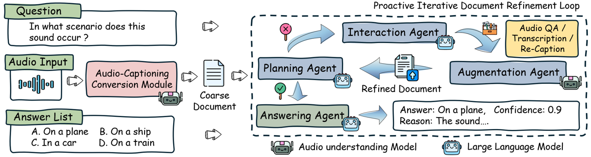

# ⚡ AudioGenie-Reasoner: A Training-Free Multi-Agent Framework for Coarse-to-Fine Audio Deep Reasoning

[](https://arxiv.org/pdf/2509.16971) 

---

**This is the official repository for "[AudioGenie-Reasoner: A Training-Free Multi-Agent Framework for Coarse-to-Fine Audio Deep Reasoning](https://arxiv.org/pdf/2509.16971)".**

## 🚀 Roadmap
- **2025-09**: AudioGenie-Reasoner is released on arXiv.


## ✨ Abstract

Audio deep reasoning is a challenging task that requires expert-level perception, multi-step logical inference, and the integration of contextual knowledge. However, existing models suffer from a gap between audio perception and reasoning abilities due to the lack of training data with explicit reasoning chains and the absence of mechanisms for active exploration and iterative refinement.
To address these challenges, we propose AudioGenie-Reasoner (AGR), the first unified training-free multi-agent system that coordinates perception and reasoning over an evolving chain of textual evidence. 
Our key idea is a paradigm shift that transforms audio deep reasoning into complex text understanding task from a new perspective, thereby unlocking the full potential of large language models. 
Specifically, the design of AGR mimics the human coarse-to-fine cognitive process. It first transforms the input audio into a coarse text-based document. Then, we design a novel proactive iterative document refinement loop, featuring tool-augmented routes and specialized agents, to continuously search for missing information and augment the evidence chain in a coarse-to-fine manner until sufficient question-related information is gathered for making final predictions. 
Experimental results show that AGR achieves state-of-the-art (SOTA) performance over existing open-source audio deep reasoning models across various benchmarks. The code will be made publicly available.

<p align="center">
  
</p>

<p align="center"><strong>Performance comparison of AudioGenie-Reasoner with other audio reasoning models.</strong></p>


## ✨ Method

<p align="center">
  
</p>

<p align="center"><strong>Overview of the AudioGenie Framework.</strong></p>


## 🎯 Code
Coming soon.

## 📭 Contact

If you have any comments or questions, feel free to contact me (yrong854@connect.hkust-gz.edu.cn).

## 📚 Citation

If you find our work useful, please consider citing:

```
@article{rong2025audiogenie,
  title={AudioGenie-Reasoner: A Training-Free Multi-Agent Framework for Coarse-to-Fine Audio Deep Reasoning},
  author={Rong, Yan and Li, Chenxing and Yu, Dong and Liu, Li},
  journal={arXiv preprint arXiv:2509.16971},
  year={2025}
}
```
